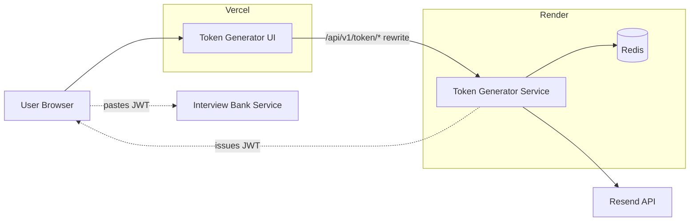
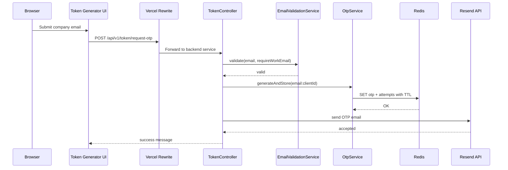
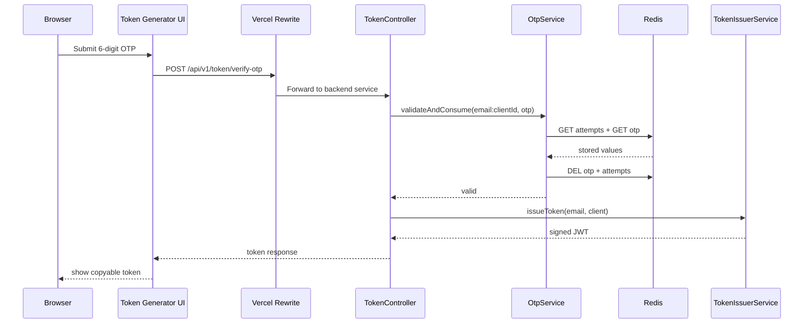

# Token Generator Architecture

This document explains how the token-generator works on its own and how it participates in the full Interview Bank submission flow.

## Big Picture

`token-generator` is a generic OTP + JWT issuing service.

- The `ui/` folder is a Vite React app deployed to Vercel.
- The `service/` folder is a Spring Boot API that can be deployed to Render.
- OTP state lives in Redis.
- OTP emails are sent through Resend's HTTPS API.
- Client apps are configured in `application.yml` under `app.clients`.

The current production flow uses it to issue contributor tokens for `interview-bank`.

## Runtime Architecture

## Main Code Map

### UI

- `ui/src/App.tsx`: entire client flow for email, OTP, and token stages
- `ui/vercel.json`: Vercel rewrite to the deployed backend

### Service

- `service/src/main/java/com/tokengen/controller/TokenController.java`: REST entry points
- `service/src/main/java/com/tokengen/service/EmailValidationService.java`: domain and MX checks
- `service/src/main/java/com/tokengen/service/OtpService.java`: Redis-backed OTP storage and verification
- `service/src/main/java/com/tokengen/service/EmailService.java`: Resend email delivery
- `service/src/main/java/com/tokengen/service/TokenIssuerService.java`: JWT signing
- `service/src/main/java/com/tokengen/config/ClientRegistry.java`: app client lookup
- `service/src/main/resources/application.yml`: clients, Redis, Resend, JWT, CORS, port

## Request Flow By API

### `GET /api/v1/token/client/{clientId}`

Purpose:

- lets the UI know which app it is serving
- changes the displayed app name and description
- determines whether work email is required

Flow:

1. `ui/src/App.tsx` reads `?app=interview-bank`.
2. It calls `GET /client/interview-bank`.
3. `TokenController.getClientInfo()` asks `ClientRegistry` for the matching configured client.
4. The response is used to personalize the UI and later OTP/JWT behavior.

### `POST /api/v1/token/validate-email`

Purpose:

- validate the email before OTP is requested

Flow:

1. The UI already blocks obvious personal/disposable domains on the client side.
2. On blur or forced submit, it calls `POST /validate-email`.
3. `TokenController.validateEmail()` resolves the client config.
4. `EmailValidationService.validate(...)` runs:
   - basic email shape checks
   - personal provider block
   - disposable provider block
   - MX lookup
5. If validation passes, the API returns success immediately.

### `POST /api/v1/token/request-otp`

Purpose:

- generate and send a one-time verification code

Flow:

1. `TokenController.requestOtp()` validates the email again server-side.
2. It creates an OTP storage key scoped by both email and client id.
3. `OtpService.generateAndStore(...)` writes:
   - the OTP value
   - the failed-attempt counter
   to Redis with TTL.
4. `EmailService.sendOtp(...)` sends the code by email.

### Sequence: OTP Request

### `POST /api/v1/token/verify-otp`

Purpose:

- confirm the OTP
- issue a signed JWT for the target app

Flow:

1. `TokenController.verifyOtp()` rebuilds the scoped Redis key.
2. `OtpService.validateAndConsume(...)`:
   - checks remaining attempts
   - reads the stored OTP
   - compares submitted value
   - increments attempts on mismatch
   - deletes the OTP and attempt keys on success
3. `TokenIssuerService.issueToken(...)` creates a signed JWT.
4. The API returns the JWT to the UI.
5. The user copies the token into the consuming app.

### Sequence: OTP Verification And JWT Issuance

## JWT Shape

`TokenIssuerService` creates tokens with:

- `sub`: verified email address
- `iss`: `interview-bank-token-generator`
- `aud`: client id, for example `interview-bank`
- `jti`: random UUID
- `iat`: issued-at
- `exp`: expiry based on client configuration
- custom claims from `app.clients[*].claims`

This is why one generic token-generator instance can serve multiple apps.

## How Interview Bank Uses The Token

When the user pastes the token into Interview Bank:

1. Interview Bank sends the token in `X-Contributor-Token`.
2. `ContributorTokenValidator` verifies it locally.
3. Interview Bank checks whether the `jti` has already been used.
4. If unused, the submission is accepted and written to Postgres.

There is no live server-to-server call back to token-generator at submit time.

## End-To-End User Walkthrough

1. User opens `https://token-generator.../?app=interview-bank`.
2. UI loads the `interview-bank` client config.
3. User types a company email.
4. Client-side checks immediately reject obvious personal/disposable domains.
5. Server-side validation confirms the domain can receive email.
6. User requests an OTP.
7. The OTP is stored in Redis with TTL and emailed through Resend.
8. User enters the OTP.
9. Redis-backed verification succeeds.
10. A signed JWT is issued and displayed.
11. User copies the token into Interview Bank's submit flow.

## Operational Notes

- Redis is only exercised during OTP request/verify, not during the `GET /client/{clientId}` path.
- That means `/actuator/health` or client info endpoints can work even if Redis has not yet been tested.
- Production routing is:
  - Vercel for `ui/`
  - Render for `service/`
  - Redis for OTP state
  - Resend for email delivery
