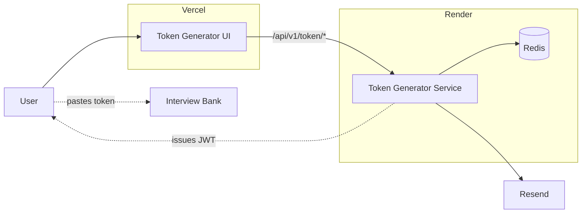
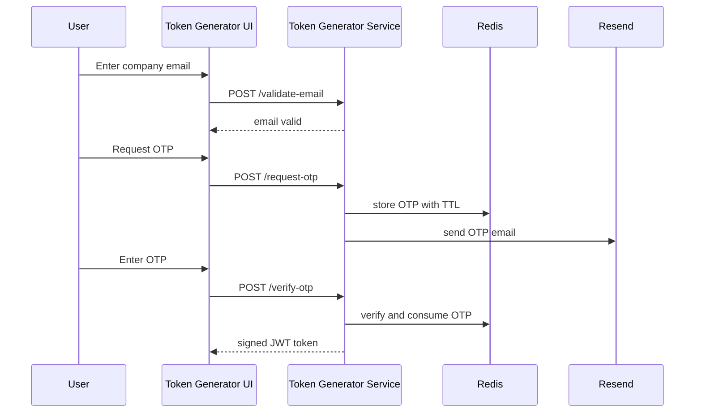

# Token Generator

Reusable OTP + JWT token service for app-specific contributor or access flows.


This folder is self-contained and can be used as its own Git repo root.

Architecture walkthrough: [ARCHITECTURE.md](/home/chinu/token-generator/ARCHITECTURE.md)

## At A Glance



## OTP To JWT Flow



## Structure

```text
token-generator/
├── service/              Spring Boot API on :8081
├── ui/                   React + Vite UI on :5174
├── docker-compose.yml    Local stack for this repo
└── .env.example
```

## What It Does

- validates email addresses
- sends OTP codes by email
- verifies OTPs
- issues signed JWTs for registered client apps

The current config includes an `interview-bank` client so the existing Interview Bank flow keeps working after the split.

## Prerequisites

Docker path:

- Docker Desktop
- Docker Compose v2

Local dev path:

- Java 17+
- Maven 3.8+
- Node.js 20+
- npm

## First-Time Setup

Create the repo-level env file:

```bash
cd /home/chinu/token-generator
cp .env.example .env
```

The repo-root `.env` is auto-loaded by the Spring Boot service for local runs.

## Run This Repo With Docker

From the repo root:

```bash
cd /home/chinu/token-generator
docker compose up --build
```

Stop it later with:

```bash
cd /home/chinu/token-generator
docker compose down
```

Services started by this repo:

- UI: `http://localhost:5174`
- API: `http://localhost:8081`
- Redis: `localhost:6379`

## Run This Repo Locally Without Docker

Terminal 1:

```bash
cd /home/chinu/token-generator
docker compose up redis -d
```

Terminal 2:

```bash
cd /home/chinu/token-generator/service
mvn spring-boot:run
```

Terminal 3:

```bash
cd /home/chinu/token-generator/ui
npm install
npm run dev
```

Local URLs:

- UI: `http://localhost:5174`
- API: `http://localhost:8081`

Stop Redis later with:

```bash
cd /home/chinu/token-generator
docker compose stop redis
```

## Run Both Repos Together

If you want the full Interview Bank submission flow to work, run this repo and the `interview-bank` repo together.

Terminal 1:

```bash
cd /home/chinu/token-generator
docker compose up redis -d
```

Terminal 2:

```bash
cd /home/chinu/token-generator/service
mvn spring-boot:run
```

Terminal 3:

```bash
cd /home/chinu/token-generator/ui
npm install
npm run dev
```

Terminal 4:

```bash
cd /home/chinu/interview-bank/service
mvn spring-boot:run
```

Terminal 5:

```bash
cd /home/chinu/interview-bank/ui
npm install
npm run dev
```

Then use:

1. `http://localhost:5174/?app=interview-bank`
2. verify the email OTP flow
3. paste the issued token into `http://localhost:5173/submit`

## Environment

Repo root `.env`:

```bash
JWT_SECRET=change-me-to-a-strong-random-secret-at-least-32-chars
RESEND_API_KEY=re_xxxxxxxxx
RESEND_FROM_EMAIL=noreply@example.com
RESEND_FROM_NAME=Interview Bank
REDIS_HOST=localhost
REDIS_PORT=6379
REDIS_PASSWORD=
```

For Docker, `docker-compose.yml` overrides `REDIS_HOST` to `redis`.

Optional UI env file for custom API or hosted environments:

```bash
cd /home/chinu/token-generator/ui
cp .env.example .env.local
```

`ui/.env.local` values:

```bash
VITE_API_BASE_URL=http://localhost:8081/api/v1/token
```

## Deploy On Vercel + Render

Production setup for this repo is:

- `ui/` on Vercel
- `service/` on Render
- Redis on Render Key Value
- OTP email through Resend
- Vercel rewrites `/api/v1/token/*` to the deployed backend service

### Render Service

In Render, create a Web Service from this repo and set:

- Runtime: `Docker`
- Dockerfile Path: `service/Dockerfile`
- Health Check Path: `/actuator/health`

Recommended Render variables on the `token-generator` service:

```bash
PORT=8081
JWT_SECRET=your-shared-jwt-secret
APP_CORS_ALLOWED_ORIGINS=https://your-token-generator.vercel.app
RESEND_API_KEY=re_xxxxxxxxx
RESEND_FROM_EMAIL=noreply@your-domain.com
RESEND_FROM_NAME=Interview Bank
REDIS_HOST=<render-key-value-host>
REDIS_PORT=<render-key-value-port>
REDIS_PASSWORD=<render-key-value-password-if-set>
```

Notes:

- Create a Resend account, verify your sending domain, and create an API key before deploying.
- Replace the Redis values with your Render Key Value connection details.
- Keep `JWT_SECRET` identical to the one used by `interview-bank`.
- The service reads `PORT`, so it can run correctly on Render.
- Render free services can spin down after inactivity, so expect a cold start after idle time.

### Render Key Value

Create a Render Key Value instance in the same region as the service, then copy:

- host -> `REDIS_HOST`
- port -> `REDIS_PORT`
- password -> `REDIS_PASSWORD` if auth is enabled

### Resend

Before the service can send OTP emails:

1. Create a Resend account
2. Add and verify a sending domain
3. Create an API key
4. Use a verified sender address in `RESEND_FROM_EMAIL`

### Vercel UI

In Vercel, import this repo and set:

- Root Directory: `ui`
- Framework Preset: `Vite`
- Build Command: `npm run build`
- Output Directory: `dist`

Set Vercel environment variables:

```bash
VITE_API_BASE_URL=/api/v1/token
```

This repo's [vercel.json](/home/chinu/token-generator/ui/vercel.json) proxies `/api/v1/token/:path*` to the deployed backend service. If the Render URL changes later, update only that destination URL. The UI code itself does not need to change.

### Post-Deploy Checks

Test in this order:

1. Render health:
   `https://YOUR-TOKEN-GENERATOR.onrender.com/actuator/health`
2. Render API:
   `https://YOUR-TOKEN-GENERATOR.onrender.com/api/v1/token/client/interview-bank`
3. Vercel proxied API:
   `https://YOUR-TOKEN-GENERATOR.vercel.app/api/v1/token/client/interview-bank`
4. Vercel UI:
   `https://YOUR-TOKEN-GENERATOR.vercel.app/?app=interview-bank`

Expected health response:

```json
{"status":"UP"}
```

## Exact Local Run Commands With Resend

Terminal 1:

```bash
cd /home/chinu/token-generator
docker compose up redis -d
```

Terminal 2:

```bash
cd /home/chinu/token-generator/service
mvn spring-boot:run
```

Terminal 3:

```bash
cd /home/chinu/token-generator/ui
npm install
npm run dev
```

Required repo-root `.env` values:

```bash
JWT_SECRET=change-me-to-a-strong-random-secret-at-least-32-chars
RESEND_API_KEY=re_xxxxxxxxx
RESEND_FROM_EMAIL=noreply@your-domain.com
RESEND_FROM_NAME=Interview Bank
REDIS_HOST=localhost
REDIS_PORT=6379
REDIS_PASSWORD=
```

## Integration Contract

- consumer apps must share the same `JWT_SECRET`
- tokens are issued with issuer `interview-bank-token-generator`
- audience is the client app id, for example `interview-bank`
- one-time token usage is enforced by the consuming app, not by this service

## Register A New Client App

Add a new entry under `app.clients` in `service/src/main/resources/application.yml`.

Example fields:

- `id`
- `name`
- `description`
- `require-work-email`
- `token-ttl-hours`
- `claims`

## API Summary

- `GET /api/v1/token/client/{clientId}`
- `POST /api/v1/token/validate-email`
- `POST /api/v1/token/request-otp`
- `POST /api/v1/token/verify-otp`
